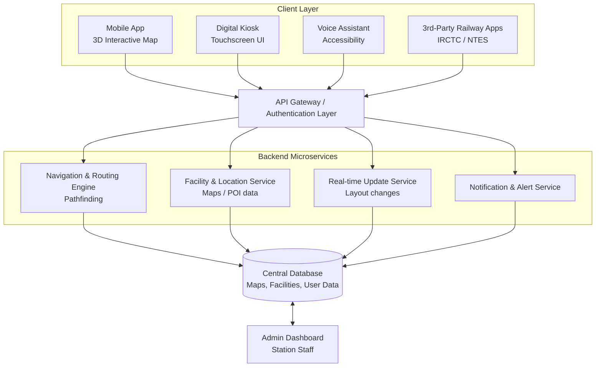
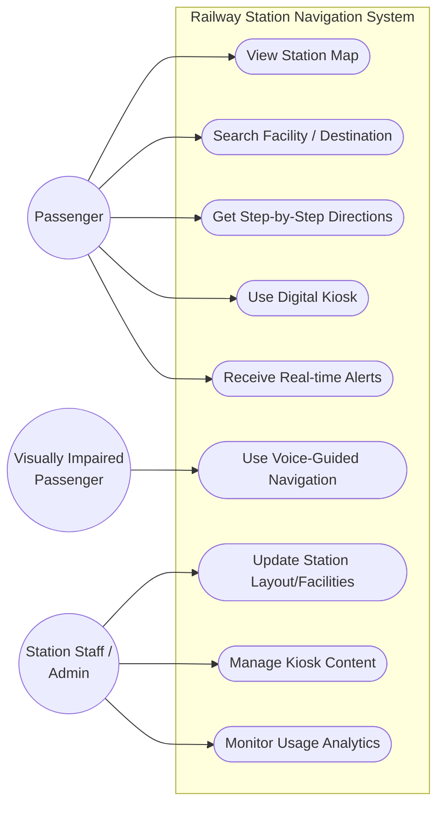

# Smart India Hackathon Workshop
# Date:17-09-2026
## Register Number:212225230064
## Name: DURGESH S
## Problem Title
# SIH 1710: Enhancing Navigation for Railway Station Facilities and Locations

**Problem Creator's Organization:** Ministry of Railway

## Problem Description

### Background
Railway stations are complex environments with numerous facilities and locations such as ticket counters, platforms, restrooms, food courts, and waiting areas. Passengers often face difficulties in navigating these spaces, especially in large or unfamiliar stations. Efficient and user-friendly navigation systems are crucial for improving passenger experience, reducing congestion, and ensuring timely travel connections.

### Description
The problem involves developing a comprehensive navigation solution for railway stations that assists passengers in locating various facilities and destinations within the station premises. This includes creating detailed maps, providing real-time directions, and integrating features such as accessibility options for individuals with disabilities. The solution should be intuitive, easy to use, and accessible via multiple platforms, including mobile devices and digital kiosks. Key challenges include updating navigation information in real-time, ensuring accuracy, and accommodating the diverse needs of all passengers.

### Expected Solution
The expected solution is a multi-platform navigation system that provides detailed, real-time directions to all facilities and locations within a railway station. This system should include:

- A mobile application with 3D interactive maps and step-by-step navigation.
- Digital kiosks located throughout the station with touch-screen interfaces.
- Voice-guided navigation for visually impaired passengers.
- Regular updates to reflect changes in station layout and facility locations.
- Integration with existing railway apps and services for seamless user experience.

The solution should enhance the overall passenger experience by reducing confusion, saving time, and improving accessibility within the station.

---

## Idea

A unified, multi-platform **"Smart Station Navigator"** that gives every passenger — regardless of device or ability — turn-by-turn indoor directions to any facility inside a railway station. The core idea is to model each station as a digital indoor map graph (nodes = facilities/junctions, edges = walkable paths), then serve real-time routes to a mobile app, station kiosks, and a voice assistant from one central backend. Station staff maintain the map and facility data through an admin dashboard, so changes (e.g., a platform closure or a relocated ticket counter) are reflected everywhere instantly.

---

## Proposed Solution / Architecture Diagram

The system follows a layered architecture: client applications (mobile app, kiosk, voice assistant, third-party railway apps) communicate through a common API gateway to backend microservices that handle routing, facility data, real-time updates, and notifications, all backed by a central database and managed via an admin dashboard.

**Key components:**

- **Client Layer** — Mobile app (3D map + step-by-step nav), digital kiosk (touchscreen), voice assistant, and integration hooks for existing railway apps.
- **API Gateway** — Handles authentication, request routing, and rate limiting across all client platforms.
- **Navigation & Routing Engine** — Computes shortest/accessible paths using graph-based pathfinding (A*/Dijkstra) over the indoor map.
- **Facility & Location Service** — Serves facility metadata (restrooms, food courts, ticket counters, platforms, etc.).
- **Real-time Update Service** — Pushes live changes in layout, platform allocation, or closures to all connected clients.
- **Notification & Alert Service** — Sends alerts (e.g., platform change, train delay affecting route) to passengers.
- **Central Database** — Stores station maps, facility metadata, and user data.
- **Admin Dashboard** — Lets station staff update layouts and facility information without code changes.

---

## Use Cases

The primary actors are the **Passenger**, the **Visually Impaired Passenger**, and **Station Staff/Admin**, each interacting with the system for a distinct set of goals.

**Representative use cases:**

- **View Station Map** — Passenger browses an interactive 3D map of the station.
- **Search Facility / Destination** — Passenger searches for a specific facility (e.g., "Platform 4", "nearest restroom").
- **Get Step-by-Step Directions** — System generates a real-time route from the passenger's current location to the destination.
- **Use Digital Kiosk** — Passenger without a smartphone uses an in-station touchscreen kiosk for the same navigation features.
- **Use Voice-Guided Navigation** — Visually impaired passenger receives spoken, turn-by-turn directions.
- **Receive Real-time Alerts/Updates** — Passenger is notified of platform changes, closures, or delays affecting their route.
- **Update Station Layout/Facilities** — Admin updates the map and facility database when the physical layout changes.
- **Manage Kiosk Content** — Admin manages what is displayed on the digital kiosks.
- **Monitor System Usage Analytics** — Admin views usage patterns to identify congestion points and improve station design.

---

## Technology Stack

| Layer | Technology |
|---|---|
| Mobile App | Flutter / React Native (cross-platform), ARCore/ARKit for AR-assisted wayfinding |
| Digital Kiosk UI | React.js / Electron for touchscreen kiosk interface, Kiosk-mode Android |
| Voice Navigation | Google Text-to-Speech & Speech-to-Text API / Amazon Polly, NLP intent parsing |
| Backend / API | Node.js (Express) or Django REST Framework, GraphQL/REST APIs |
| Real-time Updates | WebSockets / MQTT for live layout & alert push, Firebase Cloud Messaging |
| Navigation Engine | Dijkstra / A* pathfinding on an indoor graph map, Indoor positioning (BLE beacons / Wi-Fi RTT) |
| Database | PostgreSQL / MongoDB for facility & map metadata, Redis for caching |
| Maps & 3D Visualization | Mapbox Indoor / custom 3D map renderer (Three.js), GeoJSON for floor plans |
| Cloud & DevOps | AWS / Azure, Docker, Kubernetes, CI/CD (GitHub Actions) |
| Admin Dashboard | React.js + Chart.js for analytics and layout management |
| Integration | Open APIs to integrate with IRCTC / NTES / UTS railway apps |

---

## Dependencies

- Indoor floor plans / CAD maps of railway stations from Indian Railways / Ministry of Railway.
- Access to live train and platform data (e.g., NTES) for real-time alert integration.
- Indoor positioning infrastructure — BLE beacons or Wi-Fi access points for accurate indoor localization.
- Cloud hosting and CI/CD infrastructure for deployment and scaling.
- Third-party APIs: Text-to-Speech/Speech-to-Text (for voice guidance), mapping/3D rendering libraries.
- Hardware procurement and installation of touchscreen kiosks at station locations.
- Approval/coordination with Ministry of Railway and station authorities for data access and kiosk deployment.
- Accessibility compliance guidelines (e.g., WCAG) for the visually impaired navigation module.
